<div align="center">

# ⚡ AGENT: MEK
### built and operated by Mohamed Meksi



<sub>SVG above is regenerated daily by <a href="./.github/workflows/agent-console.yml">a GitHub Action</a> running <a href="./scripts/generate_console.py">this script</a> against the GitHub API, not a static image.</sub>

</div>

---

### Mission

`MEK` is an autonomous ops layer for business workflows (WhatsApp messaging, scheduling, field operations, e-commerce), built to automate the parts that don't need a human. I'm the operator: I design, build, and ship it.

```
role      : AI Agent Builder & Full-Stack Developer (operator of MEK)
core      : Python · FastAPI, Flask
interface : TypeScript · Next.js, React
agents    : LangChain, LangGraph, OpenAI Function Calling, n8n, Flowise
domain    : WhatsApp Business automation, AI agents, e-commerce & field-ops tooling
based_in  : Morocco 🇲🇦 · open to remote
```

---

### 🧩 Capabilities (modules)

| Module | Runtime | What it handles |
|---|---|---|
| `core.runtime` | Python · FastAPI · Flask | API layer, business logic, background jobs |
| `interface.layer` | TypeScript · Next.js · React | Storefronts, admin dashboards |
| `agent.layer` | LangChain · LangGraph · OpenAI Function Calling · n8n · Flowise | Conversational agents, orchestration, workflow automation |
| `data.layer` | PostgreSQL · MongoDB · Firestore · Redis | Orders, inventory, conversation state, caching |
| `ops.layer` | Docker · GitHub Actions | Deploys, scheduled agents, this README |

---

### 📦 Deployed instances

| Instance | Modules used | Function | Result |
|---|---|---|---|
| **WhatsApp Business API Gateway** | Python, FastAPI, MongoDB, Redis | Multi-tenant REST API to send, receive and track WhatsApp Business messages | In production · multi-tenant architecture |
| **WhatsApp Coexistence** | TypeScript, Node.js, Express, Prisma, PostgreSQL, Redis | Multi-tenant platform to onboard a WhatsApp Business number in coexistence mode (mobile app + Cloud API) | In production · mobile app + Cloud API running in parallel |
| **WhatsApp Catalogue Agent** | Python, FastAPI, MongoDB, WhatsApp Cloud API | WhatsApp assistant that helps customers browse a product catalogue and qualifies requests for a sales rep | In production · automatic qualification before handoff to a human |
| **WhatsApp Sales CRM** | Next.js, TypeScript, MongoDB, NextAuth | CRM to track qualified leads via WhatsApp through to sales handling | In production · used daily by the sales team |
| **WhatsApp Training Assistant** | Python, Flask, OpenAI (Function Calling), Firestore, MongoDB | Multilingual (FR/EN/AR) WhatsApp conversational agent that guides candidates from first contact to enrollment, with 17 integrated business tools | 100% of responses automated 24/7 · -80% manual management time |
| **Sales CRM** | TypeScript, React, Vite, Tailwind CSS, Supabase (PostgreSQL) | Centralizes sales tracking (leads, quotes, orders) and customer messaging for sales teams | In production · centralizes leads, quotes, and messaging in one tool |
| **[Kairos](https://kairoscopilot.com/)** · *AI Executive Copilot* | Next.js, TypeScript, Python, Flask, MongoDB | Voice copilot that drafts emails, books meetings, and manages the agenda directly from WhatsApp/Telegram | In production · 70%+ of development shipped by me · presented at GITEX Africa 2026 |
| **Piscibio** | TypeScript, Next.js, React, Prisma, PostgreSQL, Tailwind CSS | Full-stack mobile platform digitizing pool maintenance operations, from field technicians to client reporting | In production · shipped end to end |
| **[Click-Tracker](https://pypi.org/project/click-tracker/)** | Python, Flask | Web tracking library published on PyPI: real-time device/bot detection and geolocation | 1000 req/min sustained · latency < 50ms · 92% geo accuracy (city-level) |

> See [all repos](https://github.com/mohamedmeksi?tab=repositories).

---

### 📜 Mission log

```
[2026-04] GITEX Africa, Marrakech · Kairos (AI Executive Copilot) presented on stage
[2026-01] Full-Stack Developer @ DigitGrow · 3 products shipped from scratch (AI automation, WhatsApp Business, field ops)
[2025-03 → 2026-01] AI Agent Builder @ StartupSquare · WhatsApp AI systems, 100% response automation, -80% manual workload
[2025-03 → 2026-01] Technical Assistant @ Geeks Institute · 9 hackathons supervised (6 Full Stack, 1 Game Dev, 2 GenAI)
[2025] Click-Tracker published on PyPI · open-source web tracking library
[2023-01 → 2023-07] Front-End Developer Intern @ Digi4
```

---

### 📡 Uplink

<p align="center">
  <a href="mailto:mohamedmeksi37@gmail.com"></a>
  <a href="https://www.linkedin.com/in/mohamed-meksi/"></a>
</p>

<div align="center"><sub>console last synced from live GitHub activity · see task queue above</sub></div>
